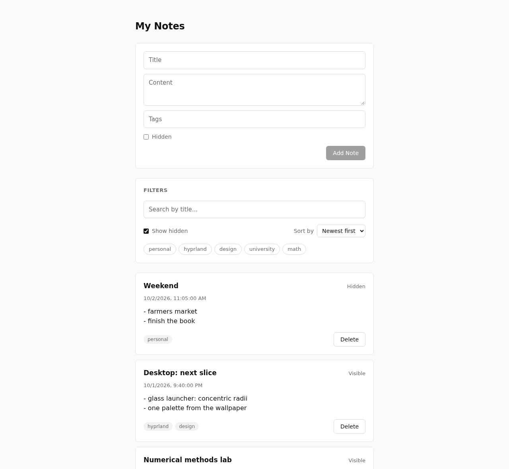

# notes

A small notes app in React 19 and TypeScript. Write a note, tag it, hide it, find it again with search, tag and sort filters, delete it — all against a local REST API served by json-server.



## Features

- Create notes with a title, content and up to five comma-separated tags
- Mark a note as hidden; every card shows whether it is visible
- Filter on the server: search by title (`title:contains`), hide hidden notes (`hidden=false`), sort by creation date newest or oldest first (`_sort`)
- Filter by tags on the client — json-server can't match inside arrays — with toggle chips; a note shows if it has any of the selected tags
- An empty-state message when nothing matches
- After creating or deleting a note the list refetches with the active filters; stale search responses are ignored
- Form state and validation on `react-hook-form`
- Dates travel as ISO strings and become `Date` objects at the edge (`mapNoteFromDTO` / `mapNoteToDTO` in `src/utils.ts`)

## Run it

Two processes: the API and the dev server.

```bash
npm install
npm run db    # json-server on http://localhost:3000, data in db.json
npm run dev   # Vite on http://localhost:5173
```

## Stack

React 19 · TypeScript · Vite · react-hook-form · json-server · CSS Modules · ESLint · Prettier

## Layout

```
src/
  components/
    App.tsx              fetch, create, delete; filter state and tag filtering
    CreateNoteForm.tsx   the form and its validation
    NoteFilterForm.tsx   search, show-hidden, sort and tag chips
    NoteCard.tsx         one note
    Button.tsx           shared button
  styles/                CSS Modules, one per component, plus global index.css
  types.ts               Note, its wire format NoteDTO, and NoteFilter
  utils.ts               DTO ↔ model mapping
```
